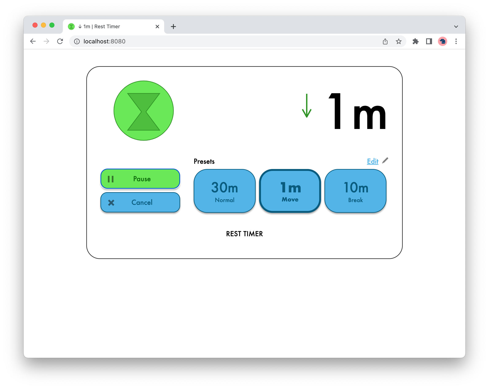
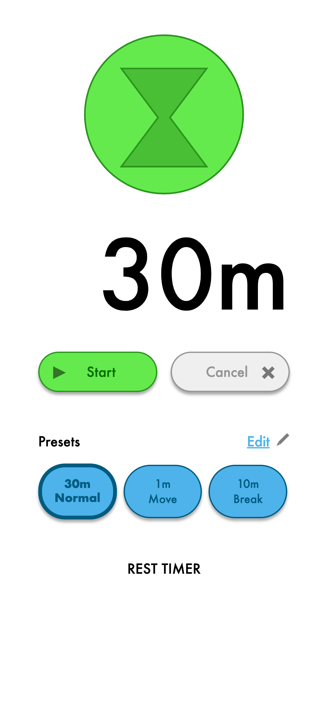

# Rest Timer

A web application, built with _React.js_, displaying a timer to help setup continuous reminders to rest and move while at the computer.

- [Analysis](docs/Analysis.md)
- [Design](docs/Design.md)
- [Code architecture](docs/Architecture.md)
- [Testing](docs/Testing.md)

Preview (version 1):

| Desktop                                                                                                            | Mobile                                                                               |
| ------------------------------------------------------------------------------------------------------------------ | ------------------------------------------------------------------------------------ |
|  |  |
