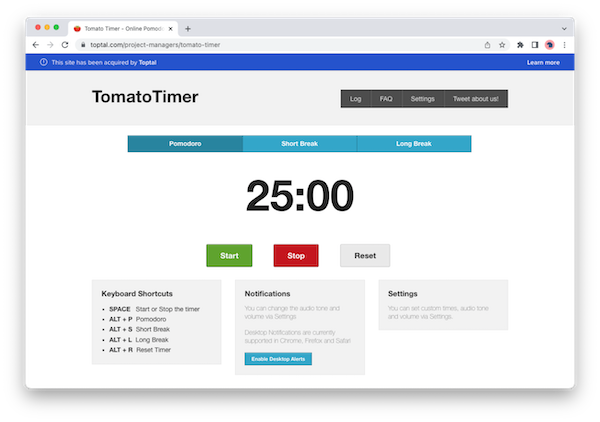
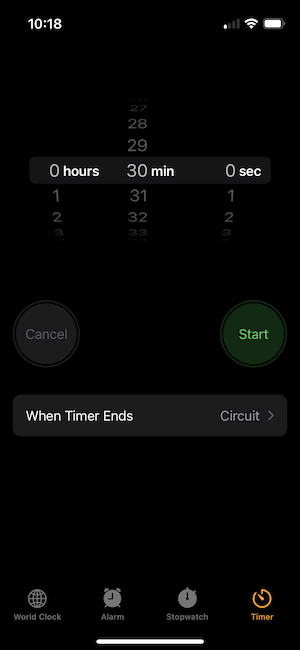
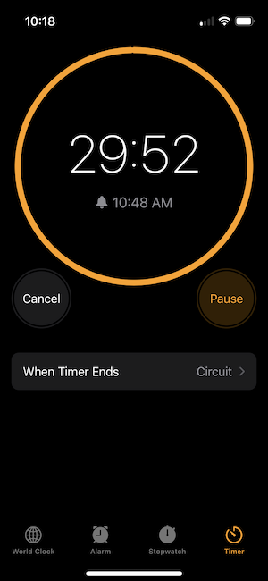
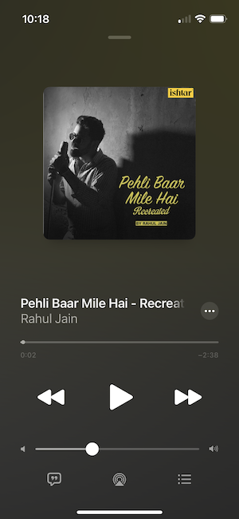
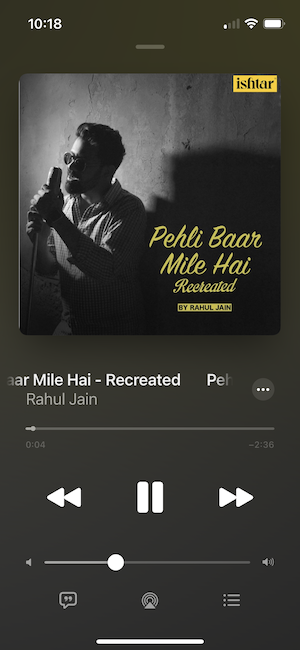
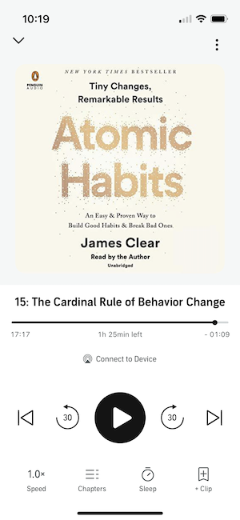
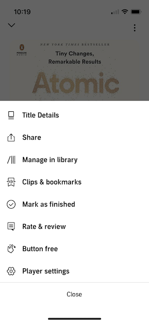
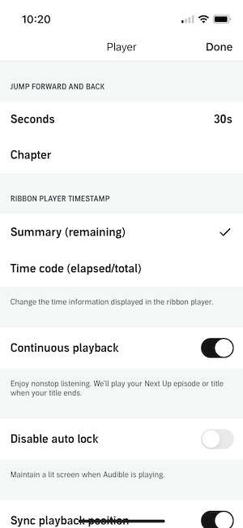

# Analysis

## Inspiration

This project's origin comes from practicing using the popular React front-end library for web application development.

Reading Dave Ceddia's article on learning React.js,
this throw-away project was created to reproduce an existing app.
I chose the tomato timer app found online,
which I found useful for a reminder to take breaks.

Here is a screen capture of its main user interface:

Although this timer was built to support the pomodoro technique,
in which small stretches of time are dedicated for focus work,
followed by periods of variable rest.

My goal is not to reproduce this timer app in its entirety,
but to create a simpler alternative with its main features such as:

- Initialize a timer with a default preset value
- Three action buttons: start, stop, and reset
- Time left on timer updating every second (or so)
- Selected timer and clear timer state with a time refresh every second
- Display notification and play audio tone when timer is up!
- Display three preset timer buttons:
  big (ex. 30 minutes; default),
  medium (ex. 15 minutes),
  small (ex. 3 minutes)
- Customize timer preset values (maybe also labels)
- Space bar shortcut to toggle play-pause state

To create contrast with the pomodoro technique,
this timer would be aimed for rest reminders.

## Research

To make a different interface, the following inspirations were drawn
from existing applications found on iOS mobile apps.

**Apple Clock timer**

| Setup                                                                   | Running                                                                   |
| ----------------------------------------------------------------------- | ------------------------------------------------------------------------- |
|  |  |

- Initial state displays the input for setting the amount of time
- Timing state displays progress using a depleting circle
- "Cancel" is used instead of "Stop" or "Pause"
- Color is used between "Start" / "Pause" button states

**Apple Music player**

| Paused                                                             | Playing                                                             |
| ------------------------------------------------------------------ | ------------------------------------------------------------------- |
|  |  |

- Playing state zooms in on the cover when transitioning from paused state.
- Progress bar is linear with small indicator minus sign (-2:36)

**Audible player**

| Paused                                                     | Playing                                                     | Settings overlay                                                   | Settings menu                                                   |
| ---------------------------------------------------------- | ----------------------------------------------------------- | ------------------------------------------------------------------ | --------------------------------------------------------------- |
|  |  |  |  |

**Dribble _timer_ tag**

- Watch in background, displaying a timer as if in a lense over it
- Encouraging thoughts with emojis
- "Start" and "end" actions instead of "Start" and "stop"
- End frame when timer is up! "End" button to choose next timer.
- Nice, glowy and vibrant center animation when timer is running.
- Sliding numbers vertically as countdown.
- Setup a workflow with what's coming next (similar to Nike Training Club app)
- Timer can also be for days

Further considerations:

- Use SVG animations to transition between times
- Integrate cues using songs (or voice/book recordings) for a day at work: warm up, longer focus, admin time, meeting time, chat break, walk break, lunch break, tea break, cooldown, study session, night session
- Build calendar templates with event types tying to the song cues
- Randomly suggest a stretching exercise for posture hygiene
- Display an inspiring personal photo or picture, front and center for starting the day
- Design cool SVG icons to transition between timers (consider SVG animations)
- See current and upcoming calendar events
- Load applications initially, cached later
- Count number of timers from each type played (stats)
- Whether or not to automatically the next preset timer
- Cue a timer playlist, select next timer
- Timer themes with backgrounds
- Display time left in the browser's tab (document.title)
- Display desktop notification
- Choose sound volume
- Customize sound per preset (ex. paper to garbage, coffee ready, call from The Rock or famous movie quote)

## Specifications

Features:

- Initialize a timer with a default preset value
- Three action buttons: start/pause/resume, cancel
- Time left on timer updating...
  - Every minute or so
- Icon translating timer state, i.e. "Started", "Paused", "Ready" (and its selected preset once started or paused)
- Play audio tone when timer is up!
- Display three preset timer buttons: big (ex. 30 minutes; default), medium (ex. 15 minutes), small (ex. 3 minutes)
- Customize timer preset values
- Customize labels for preset value buttons
- Space bar shortcut to toggle play-pause state

Functionality:

- Reactive user interface
- No network communication after first load
- Play sound
- Flexible user interface (mobile to 4K)
- Form inputs for customizations
- Locally store settings in browser when changed

## Project plan

1. User interface design ✅
1. Architecture design ✅
1. Write test cases (first draft ✅)
1. Tooling setup (ex. time tracking ✅, dev env ✅)
1. Code (static prototype)
1. Prepare and integrate assets (icons 🚥, media 🚥, etc.)
1. Code (rest of features and functionality)
1. Review test cases and test
1. Fix bugs
1. Tag version 1
1. Retrospective

**Time Tracking**

| Step                       | Time invested (h) |
| -------------------------- | ----------------- |
| Project initialization     | 1.25              |
| User interface design      | 2.25              |
| Architecture design        | 3                 |
| Test cases                 | 0.25              |
| Tooling setup              | 0.5               |
| User interface assets      | 0.5               |
| Extra (ex. tool debugging) | 1.25              |

Total: 9 hours (2022-09-13 13:00)

Tool debugging:

- Push to Github blocks when file > 1MB.
  Solution: reset commits, compress sketch image.
