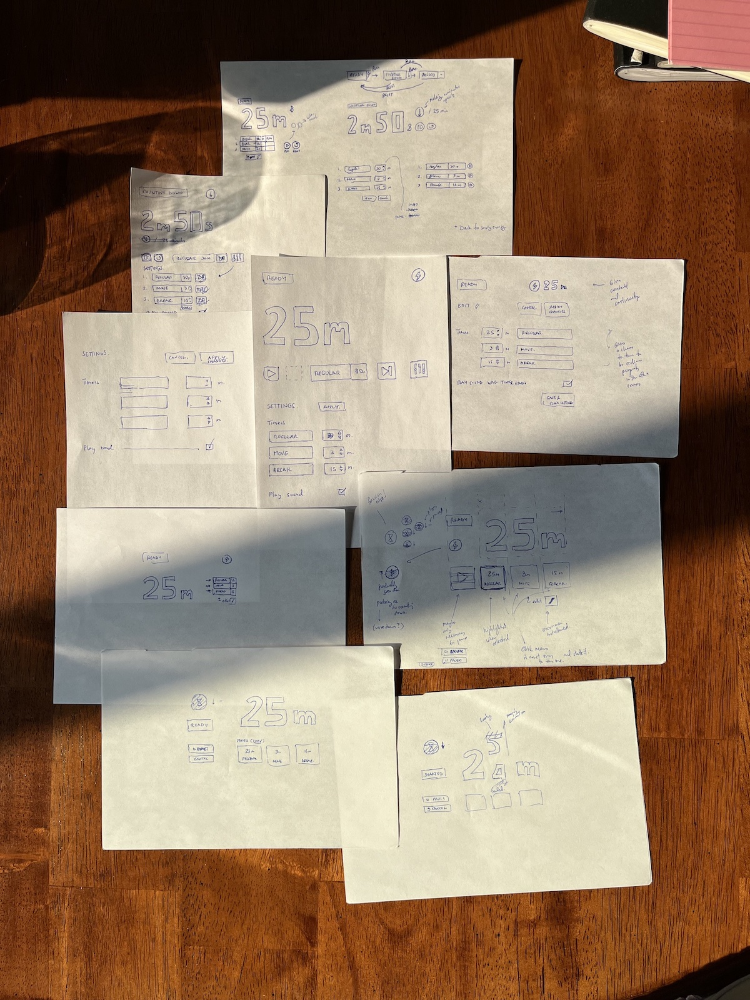

## User Interface Design

Sketches:

From top to bottom, the above pictures shows the evolution of sketches from first to last.
The bottom left sketch will be the one to build first.

The emphasis finally is set for:

- Time set or left for the timer
- Three preset timer buttons
- Pulsing logo icon activated when timer is running
- State and action buttons for starting, pausing and cancelling the timer
- Edit preset timers that opens a settings view
- Settings view (shown in the middle right) with inputs

The transition described in the bottom right will be kept for the end,
if time permits.
